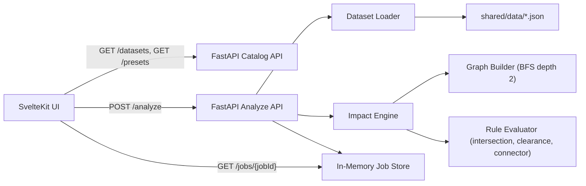

# Cross Discipline Impact Analyzer Architecture

## 1) Purpose
This project demonstrates a focused AEC impact analysis workflow:
- Select a project dataset
- Select a discipline change preset
- Run analysis
- Review ranked cross-discipline impacts with reason chains and a 2D overlay

It is intentionally local-first and deterministic, with mock BIM-style JSON data.

## 2) High-Level Design

## 3) Runtime Flow
1. Home page loads dataset/preset catalogs from backend.
2. User submits a change event.
3. Backend resolves dataset (or inline model), validates changed element IDs, creates a job.
4. Engine applies change event to geometry, builds relationship graph, traverses impact candidates, evaluates rule hits, computes severity, and returns sorted impacts.
5. Job is marked complete in memory.
6. Results page fetches job output and renders:
- summary metrics
- discipline-filtered ranked table
- reason chain for selected row
- interactive mini viewport

## 4) Backend Structure

### API Layer
- `backend/app/main.py`
  - `GET /datasets`
  - `GET /presets`
  - `POST /analyze`
  - `GET /jobs/{jobId}`

### Data/Contract Models
- `backend/app/schema.py`
  - Pydantic domain models (`Element`, `BBox`, `ChangeEvent`, etc.)
  - request/response contracts (`AnalyzeRequest`, `JobResponse`, catalog response models)
  - validation:
    - `bbox` coordinates must be valid
    - exactly one of `datasetId` or `datasetJson`

### Shared Data Loading
- `backend/app/dataset_loader.py`
  - Reads JSON from `shared/data/datasets` and `shared/data/change-events/presets.json`
  - Produces typed dataset options and preset records

### Job Lifecycle
- `backend/app/store.py`
  - In-memory dictionary + lock
  - states: `pending`, `completed`, `failed`
  - this keeps setup simple and dependency-free

## 5) Impact Engine Design

### Configuration
- `backend/app/engine/schema.py`
  - rule weights:
    - `intersection`: 0.55
    - `clearance`: 0.45
    - `connector`: 0.35
  - defaults:
    - geometry tolerance: 0.2
    - clearance fallback: 0.8
    - BFS depth: 2

### Graph Construction + Traversal
- `backend/app/engine/graph.py`
  - nodes = elements
  - undirected edge when one is true:
    - shared connector
    - explicit dependency in params (`dependsOn`)
    - same-level bbox proximity within tolerance
  - BFS from changed elements finds candidate impacted nodes + traversal path

### Rule Families
- `backend/app/engine/rules.py`
  - `intersection_rule`: changed wall intersects MEP candidate
  - `clearance_rule`: candidate center lies inside changed equipment clearance zone
  - `connector_rule`: changed/candidate share connector IDs
  - each hit returns `{rule_id, description, path_element_ids, weight}`

### Analysis Orchestration
- `backend/app/engine/analyze.py`
  - applies move/resize/relocate to changed elements
  - builds graph and candidate set
  - evaluates all changed->candidate pairs
  - aggregates severity:
    - best weight per rule type + small bonus for multi-hit
    - capped at `1.0`
  - sorts deterministically by `severity desc`, then discipline, then id
  - builds summary counts by discipline

## 6) Frontend Structure

### App Shell + Styling
- `frontend/src/routes/+layout.svelte` imports global CSS
- `frontend/src/app.css` defines design tokens and shared utility classes

### Home Page
- `frontend/src/routes/+page.svelte`
  - loads catalogs from backend
  - filters presets by selected dataset
  - submits analysis and navigates to `/results/[jobId]`

### Results Page
- `frontend/src/routes/results/[jobId]/+page.svelte`
  - polls job endpoint briefly if pending
  - displays summary cards
  - discipline filter + results table + reason chain + viewport

### UI Components
- `frontend/src/lib/components/DatasetSelector.svelte`
- `frontend/src/lib/components/ChangeEventSelector.svelte`
- `frontend/src/lib/components/RunButton.svelte`
- `frontend/src/lib/components/Filters.svelte`
- `frontend/src/lib/components/ResultsTable.svelte`
- `frontend/src/lib/components/ReasonChain.svelte`
- `frontend/src/lib/components/MiniViewport.svelte`

### Frontend API + Types
- `frontend/src/lib/api/client.ts`
  - typed client for backend endpoints
- `frontend/src/lib/types/contracts.ts`
  - TS interfaces aligned with backend contracts

### Viewport Math
- `frontend/src/lib/utils/bbox.ts`
  - computes model bounds
  - normalizes real coordinates into SVG viewport space

## 7) Shared Data + Schema Assets
- `shared/data/datasets/*.json`
  - deterministic project models (multi-discipline element sets)
- `shared/data/change-events/presets.json`
  - curated change scenarios linked to dataset IDs
- `shared/schemas/*.schema.json`
  - JSON schema references for request/result/domain payloads

## 8) Verification Coverage
- `backend/tests/test_rules.py`
  - validates each rule family and severity capping
- `backend/tests/test_analyze_api.py`
  - validates API flow, deterministic behavior, unknown job handling, catalog endpoints
- frontend static checks:
  - `npm run check`
  - `npm run build`

## 9) Design Tradeoffs
- In-memory job store over DB/queue:
  - simplest local setup
  - easy to demo
- Axis-aligned bbox geometry over CAD-grade kernels:
  - predictable and fast
  - enough realism for a short demo
- catalogs served by backend:
  - frontend options stay in sync with data files
  - avoids hardcoded dataset lists
