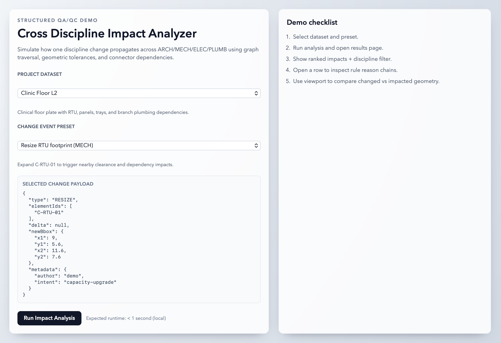
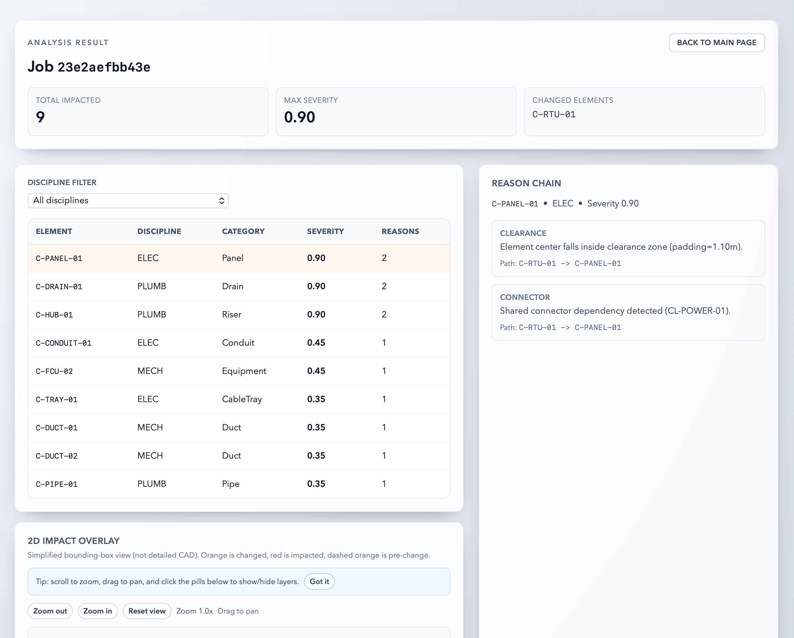
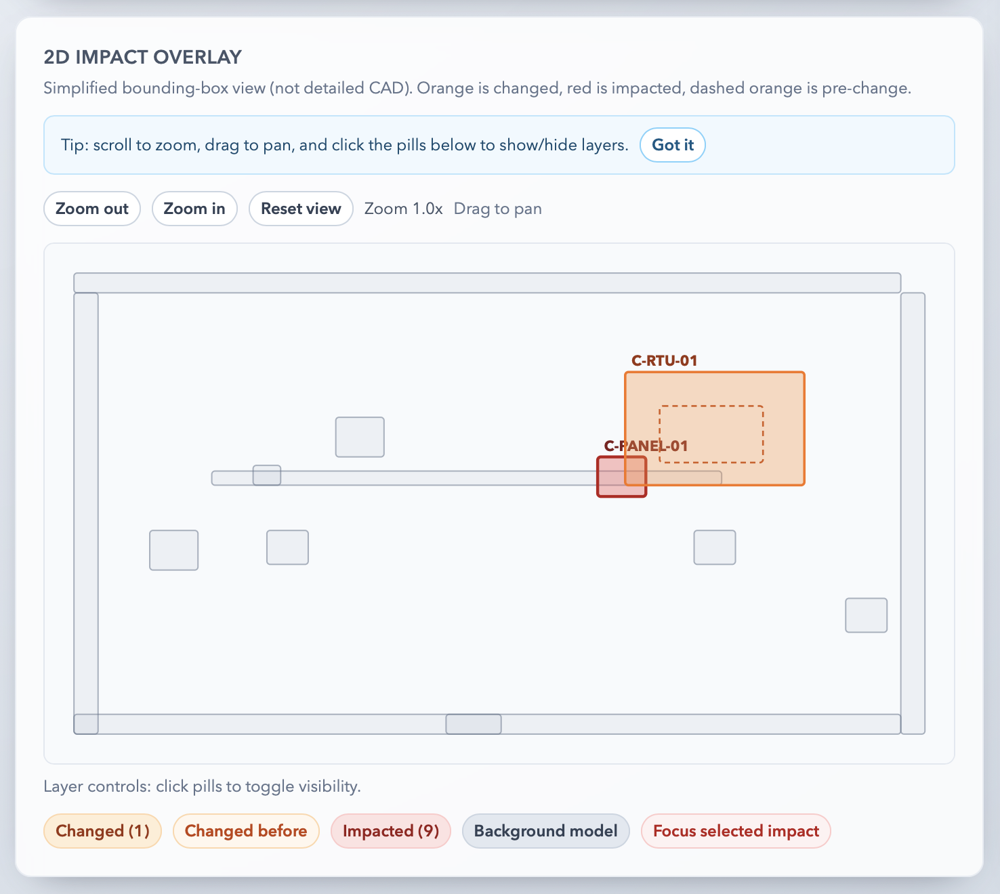

# Cross Discipline Impact Analyzer

Cross Discipline Impact Analyzer is a proof-of-concept application for AEC coordination workflows. It evaluates downstream impacts when one discipline changes an element and explains why each impact is flagged.

## Highlights
- Graph-based impact propagation (BFS depth 2)
- Rule-based impact detection:
  - Intersections
  - Clearance checks
  - Connector dependencies
- Ranked impacted elements with reason chains
- Interactive 2D overlay for changed vs impacted geometry

## Tech Stack
- Frontend: SvelteKit + TypeScript + Tailwind CSS
- Backend: FastAPI + Pydantic
- Data: deterministic local datasets in `shared/data`

## Repository Structure
- `frontend/`: UI and result visualization
- `backend/`: API and analysis engine
- `shared/`: datasets, schemas, and change presets
- `ARCHITECTURE.md`: system design and runtime flow reference
- `docs/screenshots/`: README screenshots
- `scripts/`: local developer scripts

## Prerequisites
- Python 3.11+
- Node.js 18+
- npm 9+

## Quick Start

### 1) Install backend dependencies
```bash
cd backend
python3 -m venv .venv
. .venv/bin/activate
pip install -r requirements.txt
cd ..
```

### 2) Install frontend dependencies
```bash
cd frontend
npm install
cd ..
```

### 3) Run both services
```bash
make dev
```

Open [http://localhost:5173](http://localhost:5173).

## Available Make Targets
- `make dev`: run backend + frontend together
- `make backend`: run backend only (`:8000`)
- `make frontend`: run frontend only (`:5173`)

## API Endpoints
- `GET /datasets`
  - returns available dataset options
- `GET /presets`
  - returns available change presets
- `POST /analyze`
  - body: `{ datasetId OR datasetJson, changeEvent }`
  - returns: `{ jobId, status }`
- `GET /jobs/{jobId}`
  - returns job status and analysis result

## Screenshots
### Home
Dataset and change-event selection workflow before analysis run.



### Results
Ranked impact list, severity summary, and rule-driven reason chains.



### Mini Viewport
2D overlay of changed and impacted elements with interactive controls.



## Limitations
- Uses deterministic local sample datasets and simplified mock geometry.
- Analysis is based on 2D axis-aligned bounding boxes, not full 3D BIM solids.
- Rule engine is heuristic-driven and intended for fast impact triage, not final clash sign-off.
- Job state is in-memory only; no persistent DB, auth, or multi-user workflow in this POC.

## Future Improvements
- Add persistent storage for jobs/results (Postgres) and background workers (Redis + queue).
- Expand geometry support to richer 3D checks and level-aware rule packs.
- Integrate with external model sources (IFC/Revit exports) and versioned change ingestion.
- Add explainability/reporting exports (PDF/CSV) for stakeholder review.
- Introduce user auth, role-based views, and team collaboration features.

## Verification
### Backend tests
```bash
cd backend
. .venv/bin/activate
pytest
```

### Frontend checks
```bash
cd frontend
npm run check
npm run build
```

## Notes
This is a POC and intentionally uses simplified 2D axis-aligned bounding boxes for interpretability and speed.
